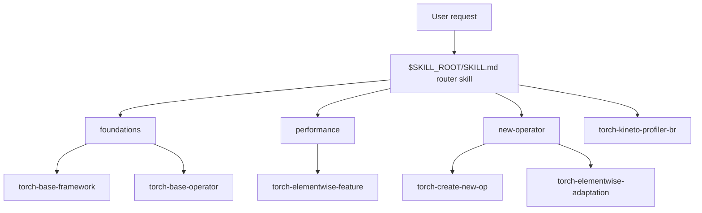

# torch-supa Workflow Skill

This skill is the torch-supa workflow router. First classify the user's request, then read only the selected child skill or README; do not load all child skills at once.

## Path convention

Paths in this document are relative to the sibling skills root `$SKILL_ROOT/..` by default.

- `$SKILL_ROOT` is provided by Claude Code when the skill is loaded. It may be a project-level, user-level, or standalone installation directory.
- For this router skill, `$SKILL_ROOT` is the `torch-supa` skill directory, and related torch-supa skills live as sibling directories under `$SKILL_ROOT/..`.
- Do not assume a fixed absolute parent directory. When referencing child skills, use `$SKILL_ROOT/../<subpath>` or the relative paths in the table.

## Architecture



## Routing rules

| User request type | Preferred route (relative to `$SKILL_ROOT/..`) | Loading cost | Notes |
| --- | --- | --- | --- |
| framework, dispatcher, PrivateUse1, SUPA initialization, basic repository understanding | `foundations/torch-base-framework/SKILL.md` | Light | Build the high-level framework model first. |
| operator dispatch, supa_native_functions.yaml, RegisterSUPANative, structured op, DispatchStub | `foundations/torch-base-operator/SKILL.md` | Medium | Use for operator ownership, registration, and call-chain analysis. |
| profiler, Kineto, SUPTI, trace, activity, graph activity, with_stack | `torch-kineto-profiler-br/SKILL.md` | Medium | Use for profiling infrastructure and trace correctness issues. |
| perf, performance regression, benchmark, elementwise feature optimization | `performance/torch-elementwise-feature/SKILL.md` | Medium | Use for elementwise feature classification, development, and optimization plans. |
| new operator, operator registration, implement operator | `new-operator/torch-create-new-op/SKILL.md` | Heavy | Use for general operator integration and registration workflows. |
| CUDA elementwise kernel migration, elementwise operator integration, kernel_entry/src_file | `new-operator/torch-elementwise-adaptation/SKILL.md` | Heavy | Use for minimal CUDA to SUPA migration. |

## BR2xx kernel handoff rule

When any routed workflow reaches work that must write a kernel, debug kernel source, or optimize kernel performance, do not keep the kernel implementation work entirely inside the current torch-supa child skill. Output a structured handoff summary and invoke the BR2xx AI operator master to complete the kernel/operator campaign, then resume the original workflow after the op-master returns artifacts and gate results.

Use the currently available BR2xx op-master skill:

- Preferred skill name in this environment: `br200-ai-op-master`.
- Treat user phrasing such as `br2xx-ai-op-master`, `BR2xx op master`, or `ai-op-master` as this same routing target unless a more specific BR2xx op-master skill is installed.

Trigger this handoff for any of these conditions:

- New `.su`, `.cu`, SUTLASS/SUPA, or CUDA-like kernel source must be created.
- Existing kernel source must be repaired after a compile/runtime/abort/mismatch failure.
- Existing kernel source must be optimized for performance, occupancy, memory access, vectorization, dtype, layout, or launch configuration.
- A performance/new-operator flow identifies an operator gap that requires kernel/operator behavior changes rather than only Python/C++ wrapper, dispatch, YAML, or build glue changes.

Before invoking op-master, output the handoff payload:

```markdown
BR2xx op-master handoff:
- source skill:
- task type: write-kernel / debug-kernel / optimize-kernel
- operator/kernel:
- failure or perf evidence:
- expected semantics/golden reference:
- shapes, strides, dtypes, layouts:
- current files and symbols:
- reproduction/build/perf commands:
- constraints: minimal change, target architecture, delivery class
- resume criteria: required artifacts/gates before returning
```

After op-master completes, resume the original child workflow using its artifacts:

- source/spec artifacts from the routed operator subskill;
- compile and correctness results from the op-master correctness gate;
- performance report when the original task is perf-related or the handoff requested optimization;
- remaining torch-supa integration work such as registration, codegen, wrappers, tests, or documentation.

## Delegation workflow

1. Classify the request using keywords and context from the user's description.
2. If the classification is ambiguous, prefer the more specific child directory. For example, elementwise performance issues go to `performance/torch-elementwise-feature/`, while elementwise new-operator migration goes to `new-operator/torch-elementwise-adaptation/`.
3. Read only the selected child skill. If the problem involves framework entry points, dispatch, or operator ownership, then additionally read `foundations/torch-base-framework/SKILL.md` or `foundations/torch-base-operator/SKILL.md`.
4. If the selected child skill needs kernel authoring, kernel debugging, or kernel optimization, apply the BR2xx kernel handoff rule above before continuing local integration work.
5. In the response, state the classification result, selected skill path, key files to inspect next, and suggested validation method.
