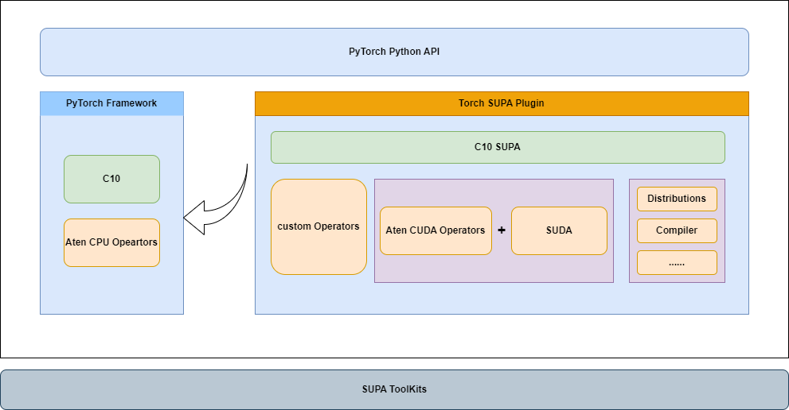

概述
==============================================================

简介
---------

Torch SUPA 是壁仞科技为其 GPU 生态适配的 PyTorch 框架插件（以下简称 torch_supa），旨在为 PyTorch 用户提供壁仞 GPU 的高性能计算支持。
torch_supa 通过 PyTorch 社区提供的 PrivateUse1 后端集成机制接入 SUPA 后端，继承了 PyTorch 的大部分特性，不仅提升了壁仞平台的易用性，
还针对壁仞 BR2xx 系列芯片的特点进行了优化，帮助用户基于 PyTorch 框架高效完成模型训练、推理与调优。

   torch_supa架构图

架构图展示了 torch_supa 在 PyTorch 框架与壁仞 SUPA 软件栈之间的适配关系。torch_supa 作为壁仞 PyTorch 适配插件，继承开源 PyTorch 的接口和生态特性，并针对壁仞 BR2xx 系列芯片及 SUPA 后端进行深度优化，支持用户基于 PyTorch 框架完成模型训练、推理和调优。

在使用方式上，用户可继续使用 PyTorch 原生接口和常见代码风格编写模型；torch_supa 通过 PrivateUse1 后端机制接管设备管理、算子分发、自动混合精度、Profiler 和分布式等能力，并将相关调用映射到 SUPA 运行时、SUDA 编译工具链和底层壁仞硬件。

同时，torch_supa 面向 PyTorch 原生库和主流第三方库提供适配支持，通过算子补齐、接口兼容和开源库迁移能力完善生态覆盖，降低现有 PyTorch 模型和依赖库迁移到壁仞平台的成本，提升 SUPA 平台的易用性。

关键功能特性
-------------

.. list-table:: torch_supa 关键功能特性
   :widths: 30 70
   :header-rows: 1

   * - 特性名称
     - 特性说明
   * - :ref:`自动加载和设备转换 <feature-auto-load-device-conversion>`
     - 自动加载 torch_supa 插件，并将 CUDA 设备自动转换为 SUPA 设备
   * - :ref:`算子适配 <feature-operator-adaptation>`
     - 支持 Native 算子注册机制和 C++ Extension 方式接入自定义算子
   * - :ref:`Profiler 工具 <feature-profiler-tool>`
     - 性能分析工具，用于统计算子执行时间，分析性能瓶颈
   * - :ref:`自动混合精度（AMP） <feature-amp>`
     - 支持 PyTorch AMP 接口，实现混合精度训练
   * - :ref:`社区开源库适配 <feature-community-library-support>`
     - 通过 SUDA 工具支持 PyTorch 社区开源库的适配
   * - :ref:`PyTorch 图模式 <feature-graph-mode>`
     - 支持 torch.compile() 和 SUPA Graph 加速
   * - 分布式训练
     - 支持原生分布式数据并行训练，包含单机多卡、多机多卡场景支持的集合通信原语，如Broadcast、AllReduce等
